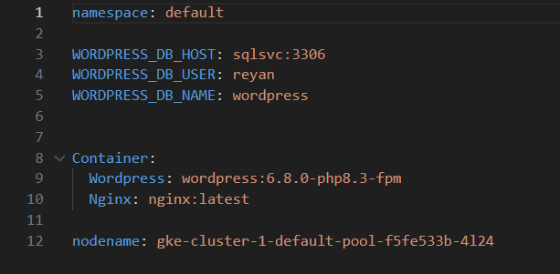

**HELM-BASED WORDPRESS LEMP DEPLOYMENT WITH NGINX INGRES CONTROLLER ON GOOGLE KUBERNETES ENGINE (GKE)**

This is a diagram of the entire kubernetes cluster, complete with NGINX INGRESS CONTROLLER, Ingress resource, Services, Deployments, PVC, SC, Configmaps and Secrets. The diagram was created using Draw.io.


File structure-<br>
|----\Charts <br>
|----\Templates<br>
|----.Helmignore\n<br>
|----Values.yaml<br>
|----Chart.yaml


Before installing this Helm Chart, don't forget to install NGINX INGRESS CONTROLLER IN YOUR CLUSTER-
You can install NGINX ingress controller using Helm from their official website- 

https://docs.nginx.com/nginx-ingress-controller/installation/installing-nic/installation-with-helm/

Don't forget to mention the Node name in the nodename variable in the values.yaml file- 


After this step, you can install the Wordpress application in your cluster using the Helm command- ```helm install <release-name> <helm-chart>```

EG- ```helm install wordpressv1 WordpressHelmChart```


You can obtain the Public IP Address using the command ```kubectl get ingress```, copy it and paste it in your browser.


