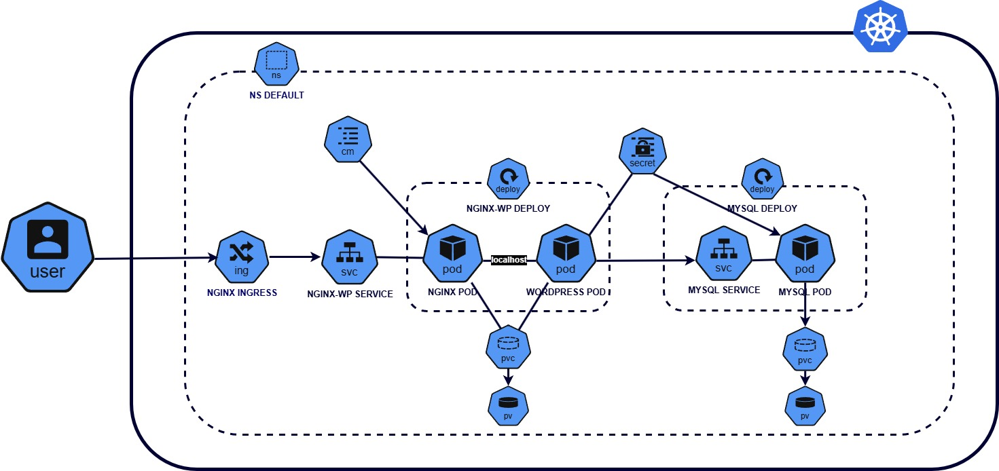

**HELM-BASED WORDPRESS LEMP DEPLOYMENT WITH NGINX INGRES CONTROLLER ON GOOGLE KUBERNETES ENGINE (GKE)**

This is a diagram of the entire kubernetes cluster, complete with NGINX INGRESS CONTROLLER, Ingress resource, Services, Deployments, PVC, SC, Configmaps and Secrets. The diagram was created using draw.io.

File structure- 
|----\Charts  
|----\Templates 
|----.Helmignore\n 
|----Values.yaml 
|----Chart.yaml

